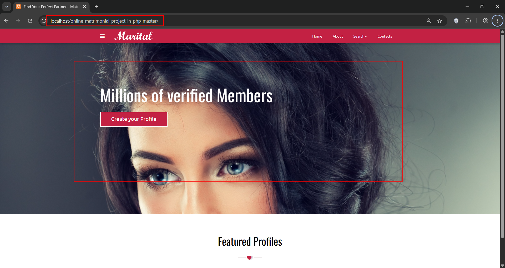
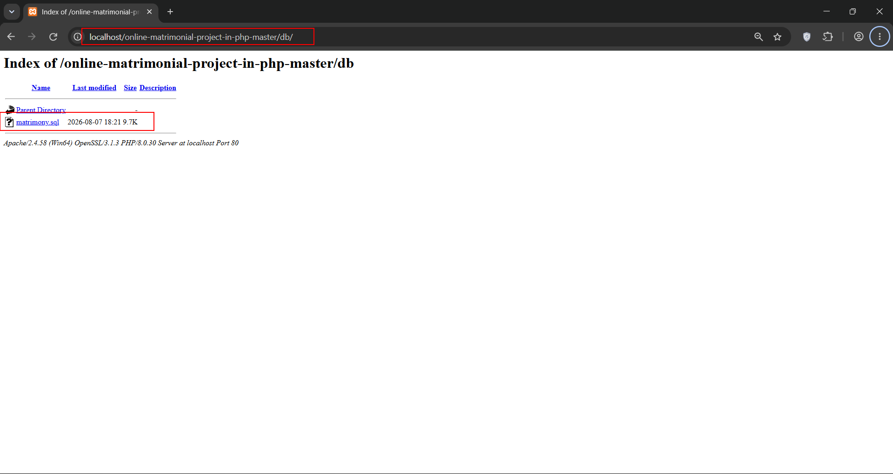
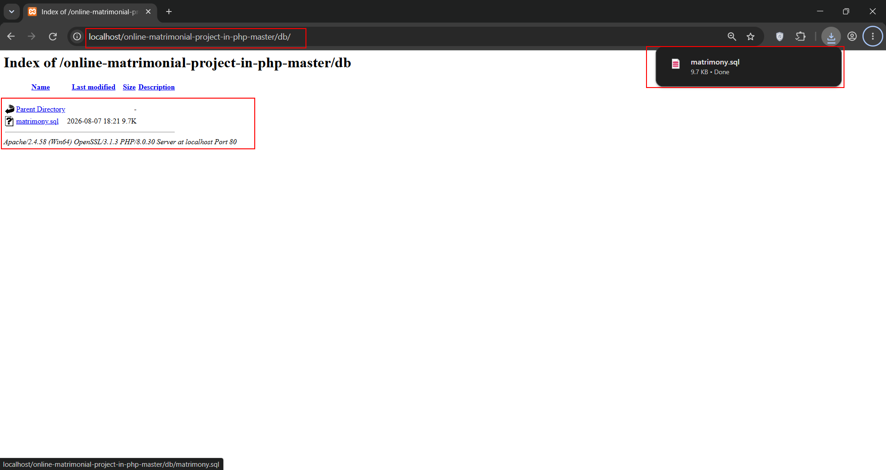
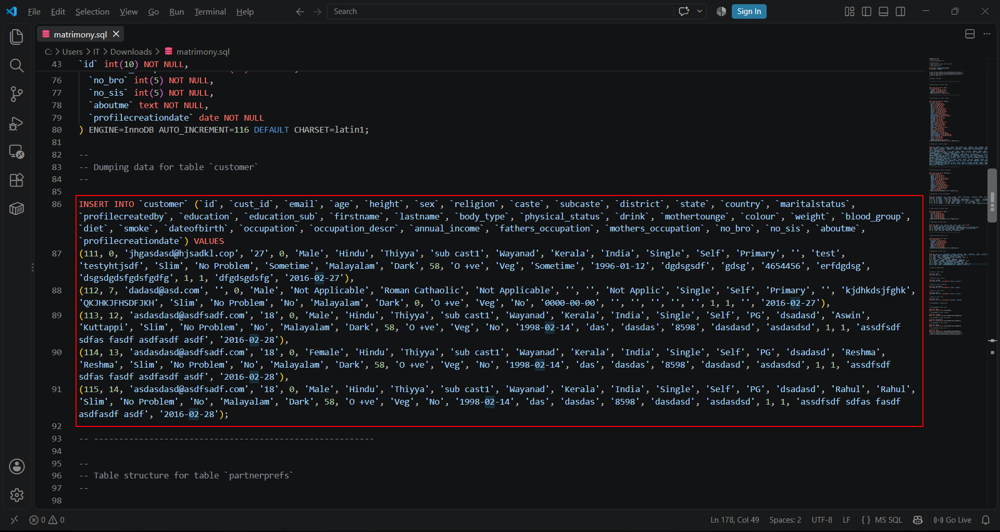
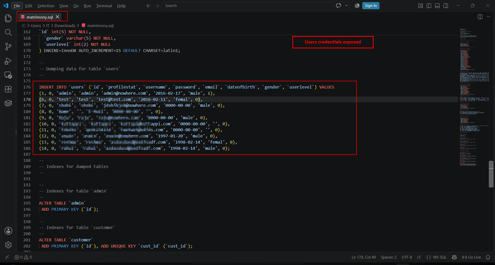

**Title:** Sensitive Information Disclosure - Credentials Exposed via publically accessible sql file

**Severity:** High

**CWE:** CWE-200 – Exposure of Sensitive Information to an Unauthorized Actor

**CVSS: 3.1/AV:N/AC:L/PR:N/UI:N/S:U/C:H/I:N/A:N — 7.5 (High)**

**Researchers:** Karan Parelkar, Abhishek Pisal

**Source / Vendor:** (code-projects Matrimonial System IN PHP, CSS, JS, AND MYSQL) : https://code-projects.org/matrimonial-system-in-php-css-js-and-mysql-free-download/

**Summary**

During security testing of the open-source Matrimonial System IN PHP, CSS, JS, AND MYSQL project from code-projects.org , credentials were found in the publicly distributed database file:

**http://localhost/online-matrimonial-project-in-php-master/db/matrimony.sql**

The credentials are accessible by simply downloading and opening the SQL file, without authentication or exploitation.

**Steps to Reproduce**

Set up the project and go to http://localhost/online-matrimonial-project-in-php-master/ we can see the project is locally deployed

 
1. Navigate to /db/

 
2. Click on matrimony.sql
    

3. Open matrimony.sql in VS Code or any text editor.

    
    
4. Sensitive Users PII data such as Date of birth, gender, email, etc. and Credential information can be observed directly in the SQL dump with password

    
    
    
 
**Impact:**

An attacker who obtains valid credentials may potentially gain unauthorized access to the associated application/account and sensitive information.

**Remediation:**

1. Remove credentials from publicly distributed SQL dumps.

2. Replace them with dummy/test credentials.

3. Never store passwords direct unhashed; use bcrypt/Argon2id.

4. Rotate any credentials that have already been exposed.

**Researchers Information**

**Researcher - 1**

Name: Karan Parelkar 

Independent Security Researcher 

Email: karan.parelkar2005@gmail.com 

GitHub: https://github.com/KaranParelkar 

LinkedIn: https://www.linkedin.com/in/karan-parelkar-6a370125b/

**Researcher – 2**

Name: Abhishek Pisal

Independent Security Researcher 

Email: abhishekpisal09@gmail.com

GitHub: https://github.com/EvilGod108

LinkedIn: https://www.linkedin.com/in/abhishek-pisal-a358bb255/

**Researcher – 3**

Name: Gaurang Kalyankar

Independent Security Researcher 

Email: gaurangkalyankar.kk@gmail.com

Linkedin: https://www.linkedin.com/in/gaurang-kalyankar-cybersecurity/
